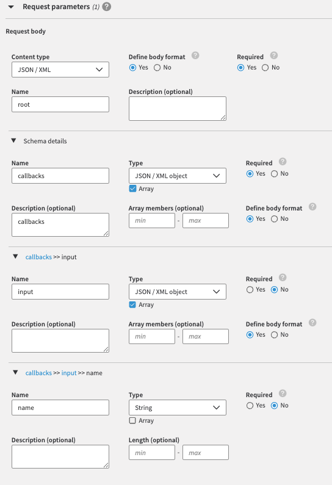

# Technical Guide: Setting Up Akamai Account Protector with PingOne Advanced Identity Cloud

## Overview
This guide outlines the steps required to integrate Akamai Account Protector with PingOne Advanced Identity Cloud (AIC). The goal is to inject the `akamai-user-risk` custom HTTP header into the PingOne AIC authentication journey and use a Scripted Decision Node to assess risk levels.

By following this guide, the authentication journey will:
- Extract the `akamai-user-risk` header from requests.
- Parse the risk score provided by Akamai Account Protector.
- Determine the outcome (High, Medium, Low, No Score, or Error) based on predefined thresholds.

## Prerequisites
Ensure you have:
- Akamai Account Protector configured for your application.
- Akamai Edge DNS and CDN settings accessible.
- PingOne Advanced Identity Cloud (AIC) administrative access.
- Experience with PingOne AIC Authentication Policies and Scripted Decision Nodes.
- Knowledge of JavaScript for modifying the authentication script if needed.

## Step 1: Configure Akamai Account Protector
Akamai Account Protector detects malicious activities and assigns risk scores to requests. To inject the `akamai-user-risk` header, follow these steps:

### 1.1 Enable Account Protector on the Akamai Edge
1. Log in to Akamai Control Center.
2. Navigate to Security Configuration and select your existing security policy or create a new one.
3. Enable Account Protector under Bot Management settings.
4. Ensure that risk scoring is enabled and that Akamai will add the `akamai-user-risk` HTTP header.

### 1.2 Add the PingOne AIC Username Parameter to Akamai Account Protector
1. In the Akamai Control Center, create an API Definition to PingOne AIC’s hostname.
2. Add an API Resource with the following:
    - **Name:** Authenticate
    - **Path:** `/am/json/realms/root/realms/alpha/authenticate`

3. Check the `POST` method and set the Request parameters as such.
4. And the Response parameters as such:



The JSON/XML Schema should be set to the following:

```json
{
  "requestBody": {
    "content": {
      "application/json": {
        "schema": {
          "type": "object",
          "required": [
            "callbacks"
          ],
          "properties": {
            "callbacks": {
              "type": "array",
              "items": {
                "type": "object",
                "properties": {
                  "input": {
                    "type": "array",
                    "items": {
                      "type": "object",
                      "properties": {
                        "name": {
                          "type": "string"
                        }
                      }
                    }
                  }
                }
              },
              "description": "callbacks"
            }
          }
        }
      },
      "application/xml": {
        "schema": {
          "type": "object",
          "required": [
            "callbacks"
          ],
          "properties": {
            "callbacks": {
              "type": "array",
              "items": {
                "type": "object",
                "properties": {
                  "input": {
                    "type": "array",
                    "items": {
                      "type": "object",
                      "properties": {
                        "name": {
                          "type": "array",
                          "items": {
                            "type": "string"
                          },
                          "maxItems": 1
                        }
                      }
                    }
                  }
                }
              },
              "description": "callbacks"
            }
          },
          "xml": {
            "name": "root"
          }
        }
      }
    },
    "required": true
  }
}
```

## Step 2: Configure PingOne Advanced Identity Cloud
Once Akamai is injecting the `akamai-user-risk` header, configure PingOne AIC to utilize this risk information in the authentication journey.

### 2.1 Create an Authentication Policy
1. Log into PingOne Admin Console.
2. Navigate to **Authentication > Policies**.
3. Create a new policy or edit an existing authentication journey.
4. Add a Scripted Decision Node to the flow.

### 2.2 Configure the Scripted Decision Node
1. In the authentication journey, click **Add Node** and select **Scripted Decision Node**.
2. Paste the following JavaScript into the node:

```javascript
/* Script to retrieve the akamai-user-risk custom HTTP header and return a risk-based outcome */

var HIGH_SCORE = 50;
var MEDIUM_SCORE = 25;

try {
    var riskHeader = requestHeaders.get("akamai-user-risk");

    if(riskHeader != null) {
        var riskString = riskHeader.get(0);

        var riskArray = riskString.split(';')
        var scoreArray = riskArray[3].split('=');
        var score = Number(scoreArray[1]);

        nodeState.putShared("score", score);

        if(score > HIGH_SCORE) {
            outcome = "High";
        } else if(score > MEDIUM_SCORE) {
            outcome = "Medium";
        } else {
            outcome = "Low";
        }
    } else {
        outcome = "No Score";
    }
} catch(e) {
    outcome = "Error";
}
```

3. Save and validate the script.

## Step 3: Use Risk Score in Authentication Decisioning
Now that the Scripted Decision Node extracts the risk score, you can configure the authentication policy to act based on risk levels.

### 3.1 Define Authentication Flow Based on Risk Score
- **High Risk (High):** Redirect to additional multi-factor authentication (MFA).
- **Medium Risk (Medium):** Allow login but prompt for additional verification.
- **Low Risk (Low):** Allow seamless login.
- **No Score:** Fallback to additional multi-factor authentication.
- **Error:** Log the event and alert security teams.

## Step 4: Validate the Setup
After implementing the integration, perform the following tests:

### Test with a Known Good User
- Verify the `akamai-user-risk` header is present.
- Ensure authentication completes smoothly.

### Check Logs and Debug
- Use PingOne logs to verify the script execution.
- Enable Akamai logging to capture risk scores.

## Conclusion
By integrating Akamai Account Protector with PingOne AIC, you can enhance authentication security using real-time risk assessments. The injected `akamai-user-risk` header allows PingOne AIC to make dynamic authentication decisions, reducing fraud risks while maintaining a smooth user experience.